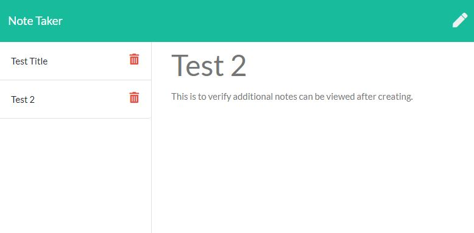

# Note Taker 

## Description

* Note Taker is a revolutionary, basic app that enables all users to make tidy easy to read notes and perserve them on a server.

## Usage

* Note Taker is easy to use and only requires the user to navigate to this link: https://note-taker924.herokuapp.com/notes.html

## Credits:

* Node Express
* Various documentation accessed via google

## Questions:
  
For additional information visit my GitHub page:
* [GitHub Profile](https://github.com/bg00924)

For questions please send me an email at:
* bg00924@gmail.com

## Preview

